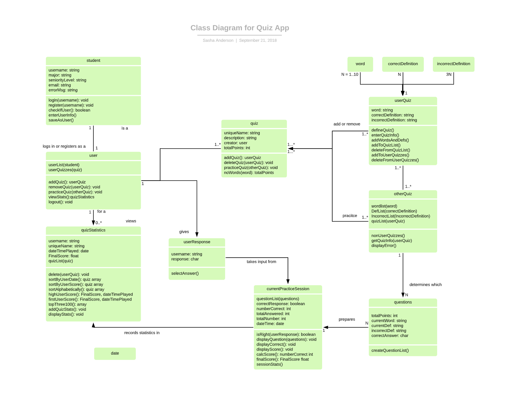
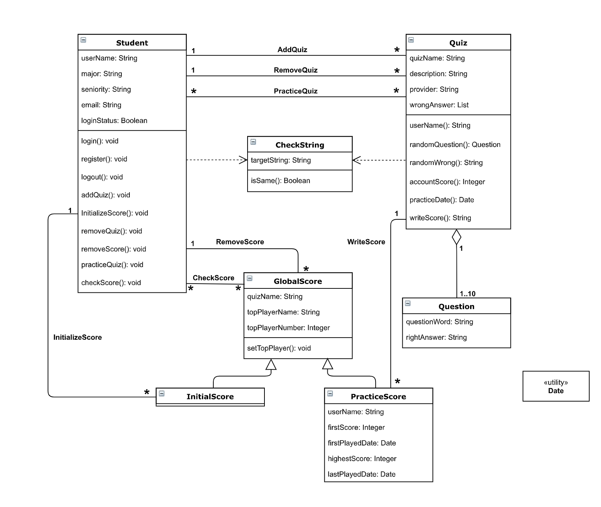
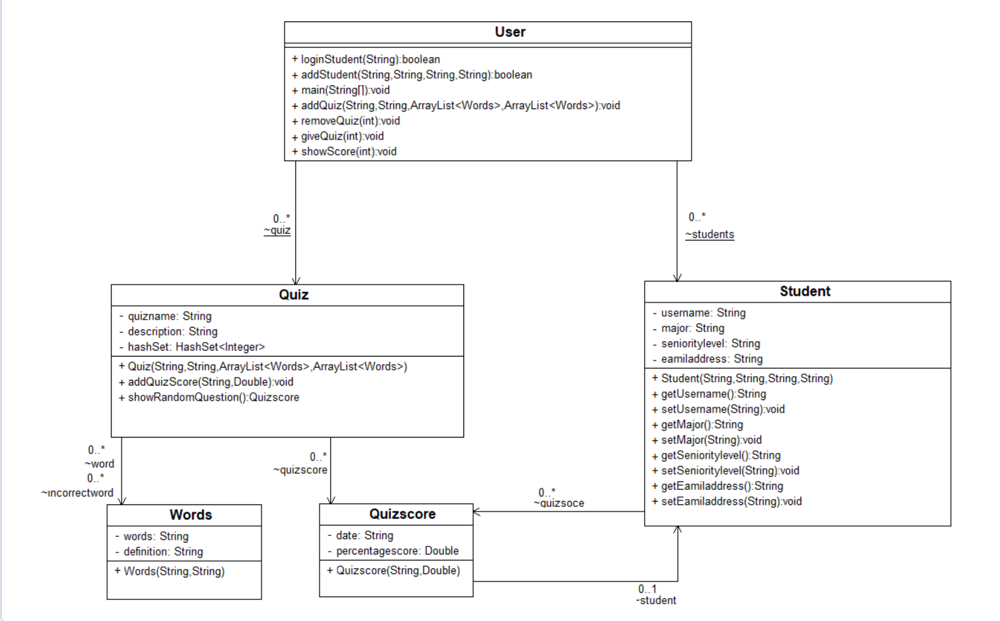
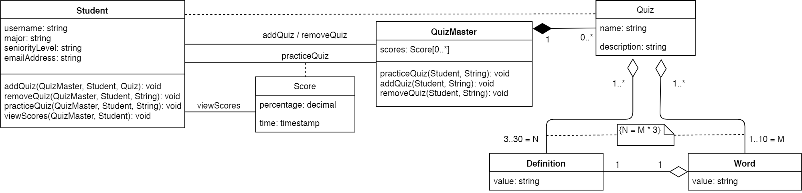
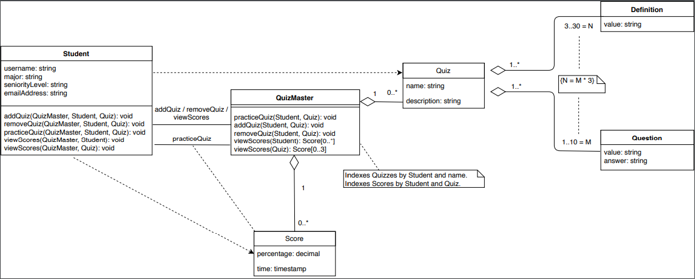

# Individual Designs
## Design 1

### Pros:
* Descriptive relationships
* Has an explicit way to encapsulate quiz sessions
* Extensively describes potential operations
* Describes the login process well
### Cons:
* Some operations might not be needed
* Too much of the GUI was included in the class diagram
* Has both a **Student** and **User** class
* Doesn't show relationships between some classes such as **Word** and **CorrectDefinition**
* Creates separate classes for UserQuizzes and nonUserQuizzes

---

## Design 2

### Pros:
* Pre-aggregates score information for performance
* Captures relationship multiplicities well
* Addresses the challenge of intializing score information
### Cons:
* Some operations might not be needed
* Design for managing score history is complex
* Doesn't address the concept of quiz sessions

---

## Design 3

### Pros:
* Explicitly calls out Java types to be used (e.g. Double, ArrayList)
* Uses HashSet for performance 
* Concise design
### Cons:
* Has both a **Student** and **User** class
* Has getters/setters
* Some multiplicites are not clear

---

## Design 4

### Pros:
* Small number of classes
* Captures compositional relationships such as that between defintions and questions
* Decouples scores from other objects for easy access
### Cons:
* Doesn't properly capture relationship between scores and quizzes
* **QuizMaster** methods take _String_ arguments but should take _Quiz_ references
* Wrong defintion count within quizzes
* Session management not clear

---

# Team Design

#### Login/Register

* The team decided that having both a student class and a user class was unnecessary.  If we combined the student and user classes in the individual diagrams, the student class in our team design has the same 4 attributes (username, major, seniority, and email) and the same four basic methods (add quiz, remove quiz, practice quiz, and view statistics).

* Our team design starts with a basic Student class, with the four attributes and four basic methods listed above, though the view statistics is acheived through 2 different methods.  One method calls the quiz statistics by student and the other calls the quiz statistics by quiz. Our intention was for the add quiz, remove quiz, practice quiz, and view statistics methods to primarily interact with the GUI, thus each method has a void return type and relies on the QuizMaster class to execute most of the logic. We removed superfluous methods from the student class, such as login, logout, register, checkUser, enterUserinfo, saveAsUser, etc.  Many of these actions will take place in the GUI and do not need to be stated in the class diagram.  The username will be checked by the username dictionary for the permissioin of register or login.  If a student registers, the username is checked for uniqueness.

#### Add/Remove a Quiz

* There were a couple different designs for creating quizzes in the individual designs, though each had between 1 and 3 sub-classes of the Quiz class for the words and definitions. 

* We decided as a team to use two different main classes for quizzes - one to represent the current quiz session and record the session score (the QuizMaster class) and a more static quiz class called Quiz which stores the words and definitions, or the contents of the quiz.  When a student chooses to add a quiz, the addQuiz method in the QuizMaster class is called.  The student enters between 1 and 10, or M, words and correct definitions (Questions class) and 3*M, or N incorrect definitions (Definitions class). These values are stored as a new Quiz instance.  Showing the relationship between the words, definitions, and quizzes was refined through discussion and we beleive the team class diagram is now clear and simple.

* When the removeQuiz method is called in the QuizMaster class the quiz is deleted, along with any scores which correspond to that quiz.

#### Practice a Quiz

* Again, in our design the QuizMaster is responsible for maintaining the state of the current quiz session. Students will make requests to practice a quiz to the QuizMaster which will internally manage quizzes (filtering out any of the student's own quizzes), display the respective quiz questions, and record the score for the session. The QuizMaster will randomize the order in which questions and definitions are presented, ensuring that each question is asked only once.

#### View Quiz Statistics

* The biggest differences between all the individual diagrams were in how to store and access quiz scores. Each design had at least one class for the quiz statistics (global score, session score, score, etc.) We decided that many methods in each of the the quiz statistics classes could be acheived implicitly (no explicit method needed), such as TopPlayer, practiceDate, sortByUserDate, sortAlphabetically, etc.

* QuizMaster stores a list of the scores (scores have the actual quiz score along with a time/date stamp) and exposes them through two operations.

* Viewing and ordering the quiz statistics deals largely with the behavior of the GUI. Exporting the list of scores to the QuizMaster allows us to do that without having to iterate through the entire list of students or quizzes. If we were to implement this design with a database, this requirement also informs how we might index that database.  We chose this design because of its simplicity, yet the relationship between the score, quiz, and student is maintained.

# Summary

By examining other designs we all deepened our understanding of the app requirements, as well as UML class diagrams.  
We all had a slightly different understanding on the required components of the class diagram. Design 1 went into too much detail on the inner workings of the app and created classes when perhaps a short explanation of the GUI would have sufficed. Designs 3 and 4 had a lot fewer classes, though the actions of practicing quizzes and viewing statistics was quite different. Creating and removing quizzes was acheived through similar methods in all four diagrams. 

Although we did not maintain the exact design used by design 2, that design's careful consideration of how scores might be managed informed how we thought about scores when creating a team design. The idea of a central quiz manager was taken from design 4, but its management of scores was heavily influenced by the techniques used in other designs. By drawing from simpler designs and bringing in ideas from the more detailed designs, we arrived in a good place for both conciceness and correctness.

