# Design Document
#### Version 2

#### **Author**: Team 12

## 1 Design Considerations

### 1.1 Assumptions

* The software will be used by students who wish to create, manage, or take quizzes.
* The software will facilitate these functions and manage data relevant to them.
* The software will be operated exclusively by students.
* The removal of a quiz -- and its score history -- by its creator is a permanent action.

### 1.2 Constraints

* Information stored by the software must persist between uses of the software.
* Student users' score history must be maintained, but not the details of their quiz history. Quiz information and student information must be maintained.
* Access patterns to stored data are well-defined and the storage format must be optimized for these patterns.
* All information must be stored locally by the software.
* The UI must be conducive to small screens.
* The UI must be conducive to use by young students.
* Text inputs contain only ASCII characters
* Text inputs do not exceed 300 characters in length

### 1.3 System Environment

* The software will be a mobile application for Android devices.
* The software will target Android version 8.0 (API 26).
* The software will be deployed as an Android Package (APK) no larger than 10MB.
* The software will use an embedded SQLite database for storage.

## 2 Architectural Design

### 2.1 Component Diagram

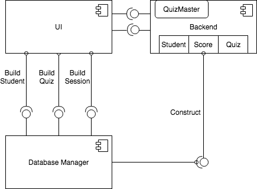

* The software will be implemented using an event-driven approach wherein UI inputs trigger actions in the backend which potentially lead to changes in the UI.
* The UI relies on the backend components to persist data and retrieve persisted data.
* The UI utilizes the database manager to construct forms used to create student and quiz creation entries, as well as the form used to take a quiz.
* The backend component includes classes for students, quizzes, and scores as well as a singleton object called QuizMaster which can manage the application state.
* The backend utilizes a database management component to interface with the embedded database in order to abstract away the database implementation.
* all the operations are done in UI classes and pushed down to the database manager.

### 2.2 Deployment Diagram

* The software will be deployed as a single APK. This APK could be independently installed or released through a platform such as Google Play.

## 3 Low-Level Design

### 3.1 Class Diagram

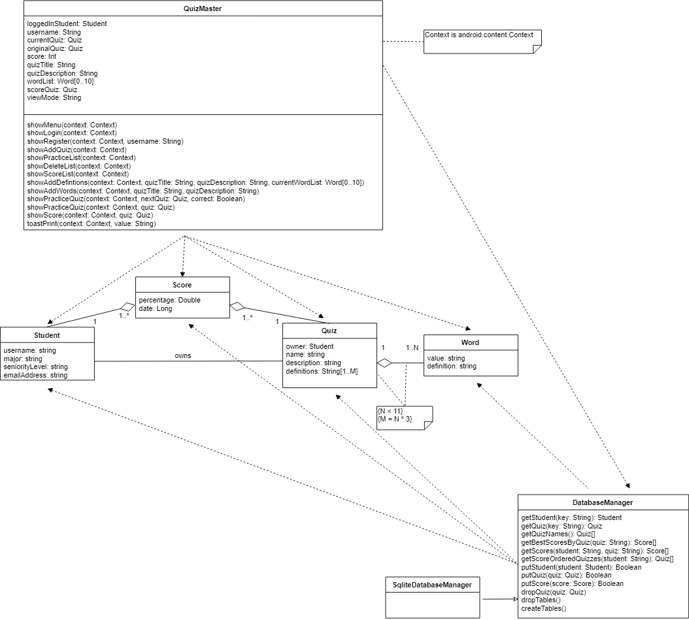

This represents the overall relationships between classes in our design. The *QuizMaster* singleton object contains the application's business logic. It receives events from UI classes and uses them to manage the application state and trigger new UI events. The QuizMaster interacts with the *DatabaseManager* in order to persist data and read persisted data. *SqliteDatabaseManager* is an implementation of *DatabaseManager*. Other classes serve as the basic data types for the system.

---

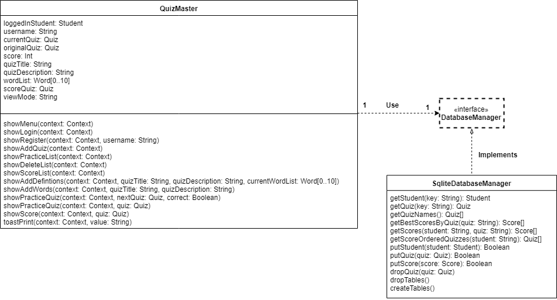

This class diagram represents the relationship between the *QuizMaster* and the *DatabaseManager* interface which is responsible for interacting with the backend database. Additionally, the *SqliteDatabaseManager* implementation of *DatabaseManager* is shown here with the requisite operations available.

---

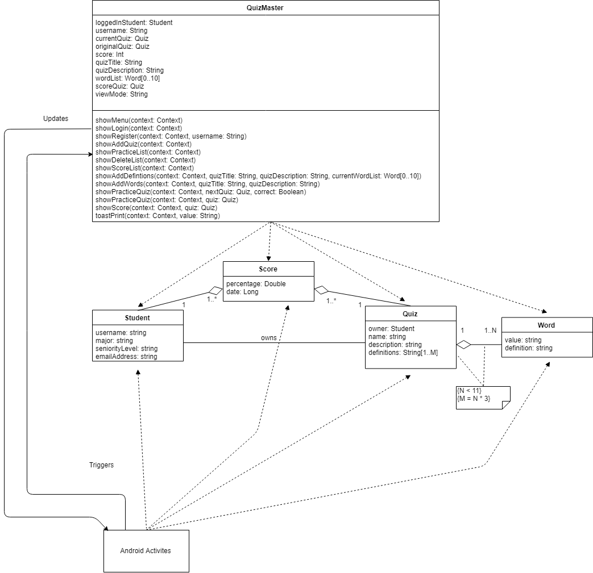

This diagram shows how the frontend classes, which generally have the same dependencies, interact with the *QuizMaster* and data type classes. Various Android activities exist for different UI operations but are not depicted here as they don't contain logic or functionality outside of the UI. Notably, the UI classes do not interact with the *DatabaseManager* but rely on the *QuizMaster* to manage the application state.

### 3.2 Other Diagrams

The login/registration process is described in the following diagram:  

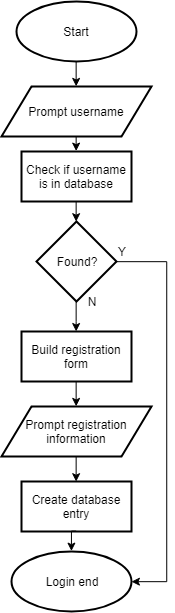

The following entity relationship diagram shows the design of the embedded database:

## 4 User Interface Design

A wireframe representation of the login screen is shown below:

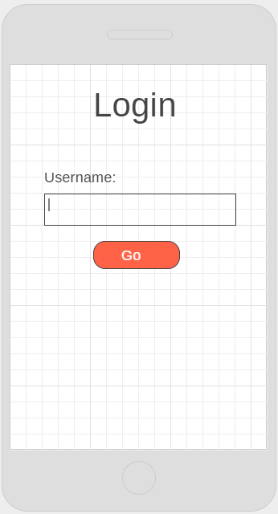

From there, the users will land on the menu page:

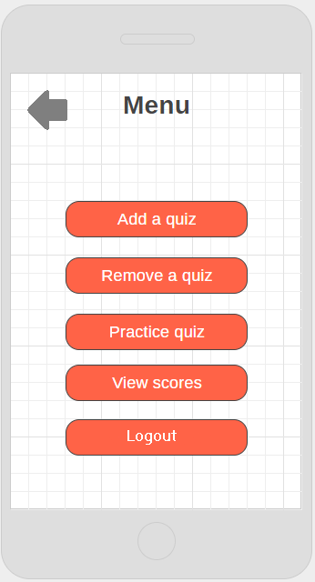

When a user wants to interact with a quiz by taking it, viewing its scores, or deleting it, quizzes can be listed out on a page like the following:

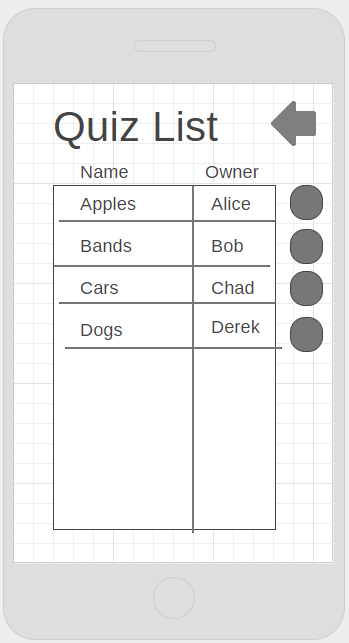

The following wireframe represents how quizzes might be taken:

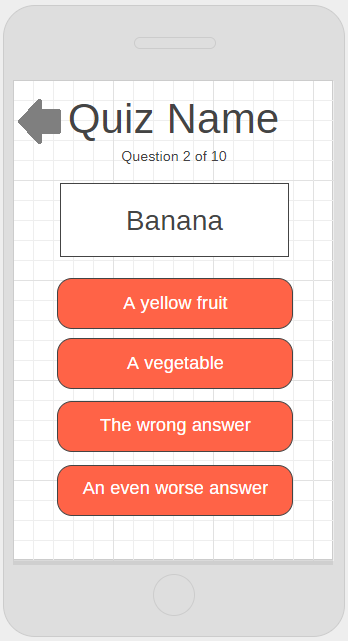

The following wireframe represents how quizzes might be created:

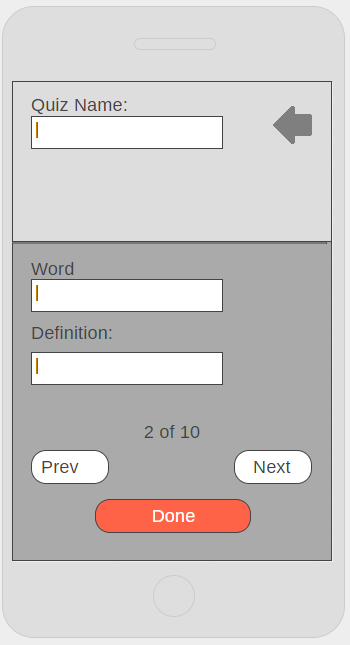

Although not shown here, after creating the quiz with sufficient words and their correct definitions, the user would also be prompted to input the corresponding number of bad definitions with a similar interface.

A similar page is used for registration of new students:

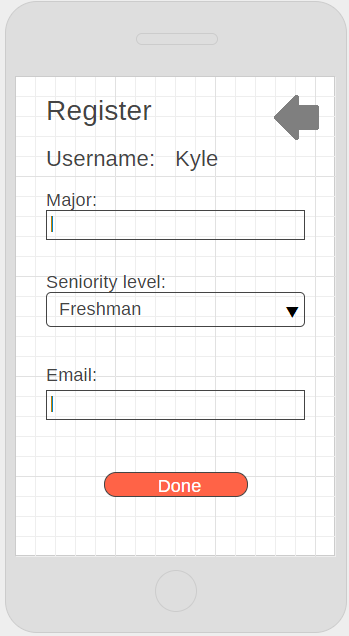

