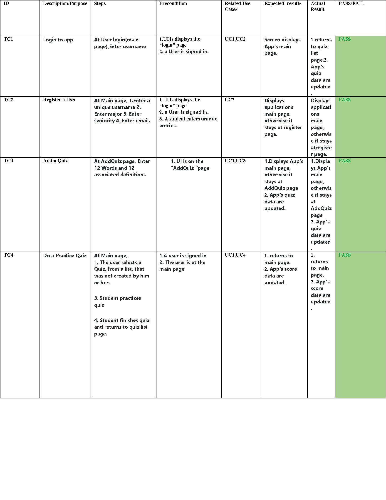
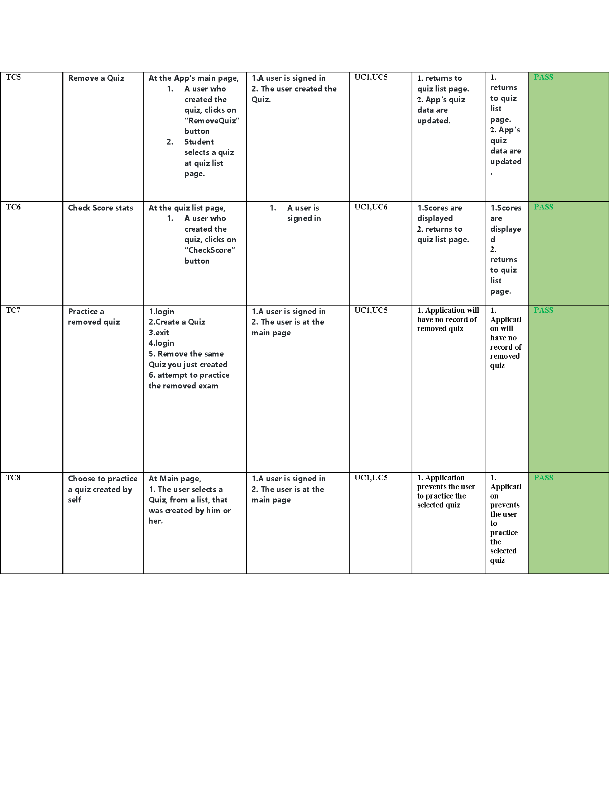

# Test Plan
**Author**: Team 12 
## 1 Testing Strategy
### 1.1 Overall strategy
- The overall strategy contains 4 parts: 1. unit test 2. integration test 3. system test 4. regression test
  - Unit tests will be taken by each development team member independently. All units would be tested under various conditions to make sure every unit works as intended.
  - Integration test will be taken by each development team member once the unit test has done to resolve any conflicts between units.
  - System test will be taken individually by the test team members to check the system works in every aspects as required. Both functionality and display of the system will be tested under various enviroments (devices, use cases, test cases, etc). 
  - Regression test will be taken by development team and test team members once there is a modification in the code. All the components related to the modification will be tested.
  - UI/UX will also be tested manually by daily use of all team member.
  - Stress tested will be taken manually by daily use of all team member.
  - Test reports will be documented and aligned with the particular version and tracked through Github.

### 1.2 Test Selection
- White box techniques will be used for unit test and integration test.
- Black box techniques will be used for system test and regression test.

### 1.3 Adequacy Criterion
- Testcases should cover 80% of the functional units with 100% pass rate.
- Testcases should cover 100% of the Usercases with 100% pass rate.
- All Testcases should be re-implement with 100% pass rate in regression test.
- All the existing or potential defects should be documented.

### 1.4 Bug Tracking
- Bugs as well as enhancement requests will be tracked through Github. 
- Bugs will be reported in the test report and designated to certain developer to debug.
- All bugs should be solved before new version released.

### 1.5 Technology
- For unit test and integration test we will use JUnit.
- For system test we will use Espresso (JUnit4 that uses Espresso API).

## 2 Test Cases
- Test cases are presented in test reports. 
- All cases should be tested for new released version.
- Failed tests and bugs should be listed in test report.

### Test report 1
- version: 1.0
- date: 10/11/2018
- test member: Eric Maynard(unit), Sasha Anderson(UI/UX), Jianxiao Hu(system tests), Lamar Lyons(stress tests)
- failed test & bugs: N/A

- Database Unit Tests

| Test Case | Purpose                     | Steps                                                         | Expected Result                                                                       |Actual result                                                      | Pass/Fail Information | Aditional info |
| ----------|-----------------------------|---------------------------------------------------------------|---------------------------------------------------------------------------------------|-------------------------------------------------------------------|-----------------------|----------------|
| 1         | test db add one Student     | insert one student to db                                      | student stored in db                                                                  |student stored in db                                               | Pass                  | Junit          |
| 2         | test db add multiple Student| insert two student to db                                      | students stored in db                                                                 |students stored in db                                              | Pass                  | Junit          |
| 3         | test db add oneQuiz         | insert one quiz to db                                         | quiz stored in db                                                                     |quiz stored in db                                                  | Pass                  | Junit          |
| 4         | test db add multiple Quiz   | insert two quizzes to db                                      | quizzes stored in db                                                                  |quizzes stored in db                                               | Pass                  | Junit          |
| 5         | test db add score           | insert score to db                                            | score stored in db                                                                    |score stored in db                                                 | Pass                  | Junit          |
| 6         | test db add multiple score  | insert two score to db                                        | scores stored in db                                                                   |scores stored in db                                                | Pass                  | Junit          |
| 7         | test db get sorted quizzes  | retrieve quizzes sortted by scores                            | quizzes sortted by scores                                                             |quizzes sortted by scores                                          | Pass                  | Junit          |

- System Tests

| Test Case | Purpose                     | Steps                                                         | Expected Result                                                                       |Actual result                                                      | Pass/Fail Information | Aditional info |
| ----------|-----------------------------|---------------------------------------------------------------|---------------------------------------------------------------------------------------|-------------------------------------------------------------------|-----------------------|----------------|
| 1         | test login succeeds         | login with a existing username                                | enter main page                                                                       |enter main page                                                    | Pass                  | Espresso       |
| 2         | test login fails            | login  with a non-existing username                           | enter register page                                                                   |enter register page                                                | Pass                  | Espresso       |
| 3         | test register process       | fill and submit registration form                             | enter main page                                                                       |enter main page                                                    | Pass                  | Espresso       |
| 4         | test logout                 | logout at main page                                           | user logged out and enter login page                                                  |user logged out and enter login page                               | Pass                  | Espresso       |
| 5         | test addQuiz process        | fill and submit addQuiz form                                  | 1.back to main page 2.quiz stroed in database                                         |1.back to main page 2.quiz stroed in database                      | Pass                  | Espresso       |
| 6         | test practiceQuiz process   | choose and finish a quiz session                              | 1.back to main page 2.socre updated at database                                       |1.back to main page 2.socre updated at database                    | Pass                  | Espresso       |
| 7         | test remove process         | choose and delete a quiz                                      | 1.quiz removed from database 2.quizdata removed from database                         |1.quiz removed from database 2.quizdata removed from database      | Pass                  | Espresso       |
| 8         | test checkScore process     | choose and check a quiz                                       | 1.quiz info shown                                                                     |1.quiz info shown                                                  | Pass                  | Espresso       |

-UI/UX/Stress Texts

| Test Case | Purpose                     | Steps                                                         | Expected Result                                                                       |Actual result                                                      | Pass/Fail Information | Aditional info |
| ----------|-----------------------------|---------------------------------------------------------------|---------------------------------------------------------------------------------------|-------------------------------------------------------------------|-----------------------|----------------|
| 1         | UI displany                 | check all UI display elements                                 | displays properly                                                                     |displays properly                                                  | Pass                  | Manual        |
| 2         | UI function                 | check all UI functional elements                              | input box, button, etc works properly                                                 |input box, button, etc works properly                              | Pass                  | Manual        |
| 3         | UX test                     | check all app function UX                                     | no lag/crash                                                                          |no lag/crash                                                       | Pass                  | Manual        |
| 4         | Stress texts                | check all app function                                        | no lag/crash                                                                          |no lag/crash                                                       | Pass                  | Manual        |

## Test report 2
- version: 1.0
- date: 10/11/2018
- test member: Lamar Lyons
- failed test & bugs: N/A

## Test report 3 
- version: 1.1
- date: 10/1812018
- test member: Jianxiao Hu
- failed test & bugs: N/A

- System Tests

| Test Case | Purpose                     | Steps                                                         | Expected Result                                                                       |Actual result                                                      | Pass/Fail Information | Aditional info |
| ----------|-----------------------------|---------------------------------------------------------------|---------------------------------------------------------------------------------------|-------------------------------------------------------------------|-----------------------|----------------|
| 1         | test quizName uniqueness    | add an exist quiz name                                        | 1.screen throws message 2.stays at current addQuiz form                               | 1.screen throws message 2.stays at current addQuiz form           | Pass                  | Espresso       |
| 2         | test same wrong definition  | enter same wrong definiation for same quiz                    | 1.screen throws message 2.stays at current addQuiz form                               | 1.screen throws message 2.stays at current addQuiz form           | Pass                  | Espresso       |
| 3         | test register info          | register and check info in database                           | 1.user's info exist in db                                                             | 1.user's info exist in db                                         | Pass                  | Espresso       |
| 4         | test incorrect definition   | enter incorrect definition box same as word or definition     | 1.screen throws message 2.stays at current addQuiz form                               | 1.screen throws message 2.stays at current addQuiz form           | Pass                  | Manual        |
| 5         | test null input             | add quiz without quiz title                                   | 1.screen throws message 2.stays at current addQuiz form                               | 1.screen throws message 2.stays at current addQuiz form           | Pass                  | Manual        |
| 6         | test randomness             | practice same quiz twice                                      | 1.the order of word and selections are random                                         | 1.the order of word and selections are random                     | Pass                  | Manual        |
| 7         | test removeQuiz globally    | remove a quiz and check with another account                  | 1.quiz removed from quiz list of practiceQuiz and checkScore                          | 1.quiz removed from quiz list of practiceQuiz and checkScore      | Pass                  | Manual        |       
| 8         | test quiz sort              | practice multiple quizzes and check quiz scores               | 1.quiz sorted by date, alphabet and owner                                             | 1.quiz sorted by date, alphabet and owner                         | Pass                  | Manual        |
