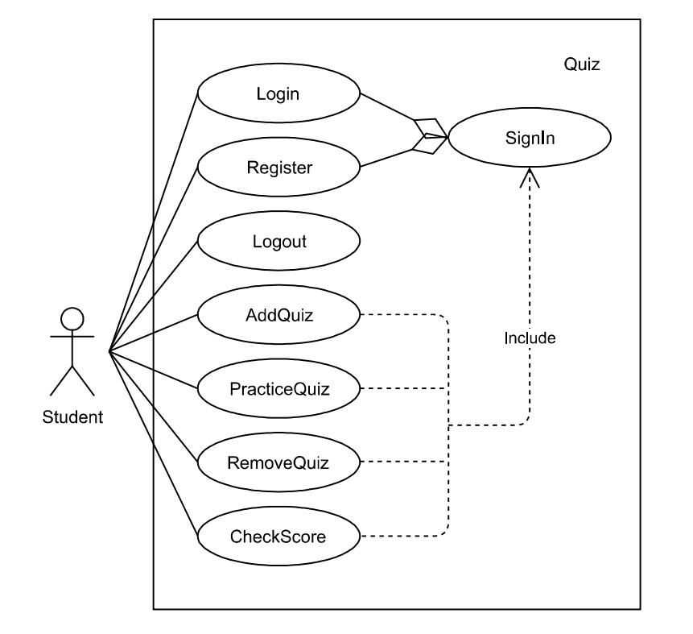

# Use Case Model

#### **Author**: Team 12

## 1 Use Case Diagram

## 2 Use Case Descriptions

#### 1. Login
- Requirements: Login requires student login the quiz app with their username.
- Pre-conditions: 
  1. Screen is on login page.
- Post-conditions: 
  1. Sign in status is true.
- Scenarios: 
  1. Student login at login page. 
  2. If login succeeded, screen shows app's main menu page. If login failed, registration form is displayed.

#### 2. Register
- Requirements: Register allows student to register with a new username, major, seniority and email.
- Pre-conditions: 
  1. Screen is on login page.
- Post-conditions: 
  1. Sign in status is true.
- Scenarios: 
  1. Student tries to login with a username which has not been registered. 
  2. Student inputs registration infomation. 
  3. If registration succeeds, screen shows app's main menupage, otherwise it stays at registration page.
  4. Student can click the back button to return to the login page.

#### 3. AddQuiz
- Requirements: AddQuiz allows student to add new quizzes to the app.
- Pre-conditions: 
  1. Sign in status is true.
- Post-conditions: 
  1. App's quiz data are updated.
- Scenarios: 
  1. Student clicks on "Add a quiz" button at the App's main page. 
  2. Student inputs quiz infomation. 
  3. If AddQuiz succeeds, screen shows app's main menu page, otherwise it stays at AddQuiz page.
  4. Student can return to main page while AddQuiz by clicking the back button.

#### 4. PracticeQuiz
- Requirements: PracticeQuiz allows student to practice a quiz.
- Pre-conditions: 
  1. Sign in status is true. 
  2. Quiz is not created by the current user.
- Post-conditions: 
  1. App's score data are updated.
- Scenarios: 
  1. Student clicks on "Practice a quiz" button at the app's main menu page. 
  2. Student selects a quiz from a list. 
  3. Student practices quiz. 
  4. Student finishes quiz and returns to the main menu page.

#### 5. RemoveQuiz
- Requirements: RemoveQuiz allows student to remove a quiz.
- Pre-conditions: 
  1. Sign in status is true. 
  2. Quiz is created by the current user.
- Post-conditions: 
  1. App's quiz data are updated.
- Scenarios: 
  1. Student clicks on "Remove a quiz" button at the Aapp's main page.
  2. Student selects a quiz to remove from a list. 
  3. Screen returns to quiz list page.
  4. Student can return to main page while in RemoveQuiz by clicking the back button.

#### 6. CheckScore
- Requirements: AddQuiz allows student to check a quiz's score statistics. 
- Pre-conditions: 
  1. Sign in status is true.
- Post-conditions: 
  1. Scores are displayed
- Scenarios: 
  1. Student clicks on "Check scores" button at the app's main page.
  2. They can select a quiz from a list. 
  3. Student checks the score statistics.
  4. Student can return to main page while CheckScore by clicking the back button.

