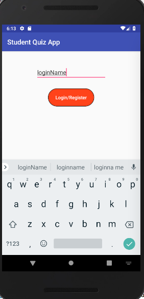
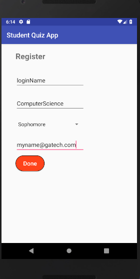
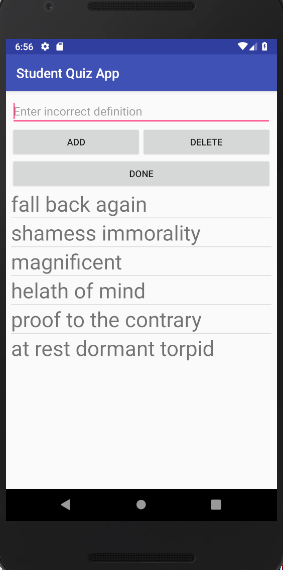
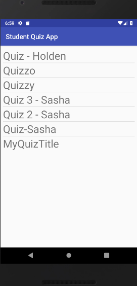
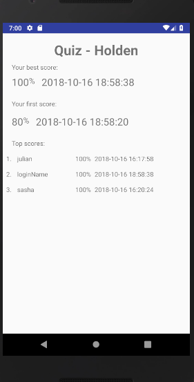

## Quiz App Manual

1.	The quiz app enters on a login screen: 

•  Login: Enter a username and click the "Login/Register" button.  If you are a current user, you will be taken to the main menu.  If not, you will be taken to a registration menu. 

•	The login name must be under 300 characters and the characters must be English (ASCII).

•	 Register: If you have not already registered, you will be taken to a registration form.  Enter your information (major, seniority Level, and email) and click Done.  Once you click done, you are taken to the main menu.  

•	Major and e-mail must be under 300 characters and characters must be English (ASCII).

2.	Main Menu: Once you are logged in, you are given the choice to add a quiz, remove a quiz, practice a quiz, view statistics, or logout.

3.	If you click "Add a quiz" in the Main Menu:

•	You are prompted to enter a unique quiz name and description.  

•	The quiz name and description must be under 300  characters and characters must be English (ASCII). 

•	Click the "Next" button.

•	Add between 1 and 10 words along with their correct definitions.  After you add the word in the first line and its corresponding definition in the second line, click "ADD".  

•	Words cannot share definitions or values

•	If you made a typo or decide not to include a word, select the word from the list and click "DELETE".  

•	Words and definitions must be less than 300 characters and the characters must be English (ASCII). 

•	Click "DONE" after you have entered all the words for the quiz.

•	You add three times as many incorrect definitions as you entered word (in above screen). 

•	Click "ADD" between each definition. 

•	Incorrect definitions cannot be the same as correct definitions in the same quiz.

•	Incorrect definitions may be up to 300 characters and characters must be English (ASCII).  

•	Click "DONE" when you have completed adding the incorrect defintions.

•	If you cannot add any more definitions, you have probably added all the incorrect definitions necessary to create the quiz.  You will see a message "You already have enough definitions!"  If you see this message, click "DONE".

4.	If you click "Remove a quiz" in the Main Menu:

•	You are given a list of quizzes that you created. Select one from the list to delete. If you decide not to delete a quiz, click the back button without selecting a quiz.

•	The quiz statistics will no longer be available for deleted quizzes.

5.	If you click "Practice a quiz" in the Main Menu:

•	You may select a quiz from a list to practice. You may only practice quizzes created by *other* students.

•	If there are no quizzes created by other users, an error message is displayed indicating there are no quizzes available to practice.

6.	If a quiz is available and is selected from the menu, the quiz starts immediately.

•	Questions appear one at a time.  A word is displayed with four options for the definition (displayed in random order).

•	Select the best response.

•	 You will see a text menu popup at the bottom indicating if you got the answer correct or incorrect.

•	You can view the percent correct in a text menu popup at the bottom once you have completed the quiz.

•	If you miss your score in the popup, you can always view it by selecting "View scores" in the main menu.

7.	If you click on "View scores" in the Main Menu:

•	A list of all quizzes taken by you are displayed in order of date (most recent first), followed by any quizzes which you created or did not take.

•	If you click on a quiz you will see your highest score and when it was achieved under "Your best score:" & your first score and when it was achieved under "Your first score". Lastly you will see the usernames of the first three students to score 100% on the quiz, listed by username in alphabetical order under "Top scores".

