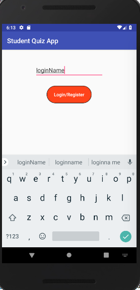
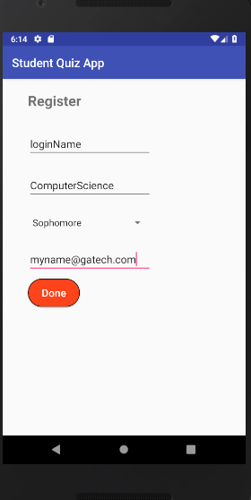
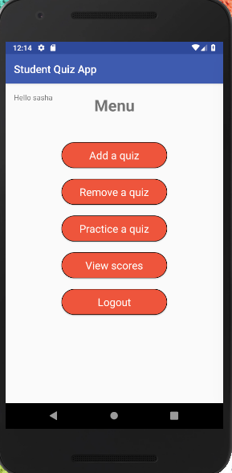
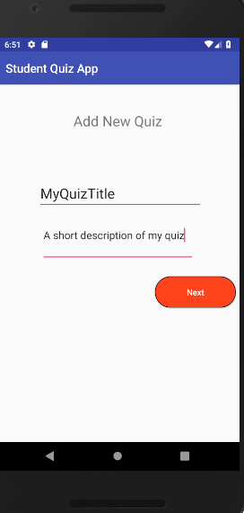
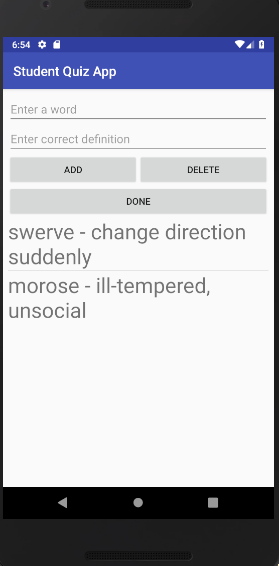
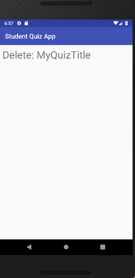
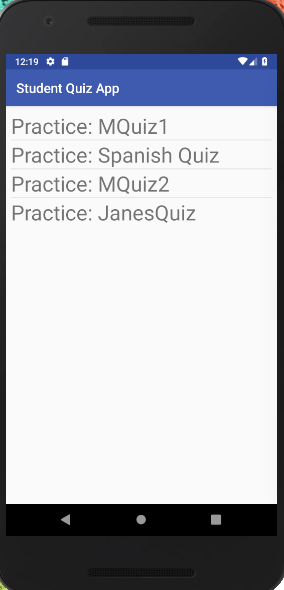
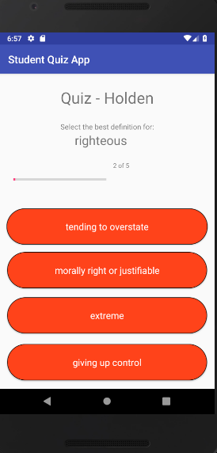
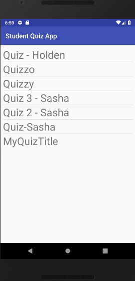
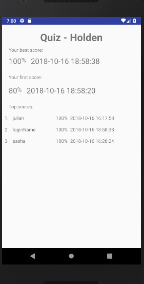

# Android-Vocabulary-Quiz-App

## DESCRIPTIONS:
This repro is the team project of Georgia Tech CS 6300 Software Development Process. 
An Android vocabulary quiz was created with agile development including requirement analysis, urse case design, software structure design, front/back end development, test plan and so on. 
Tech framework including: Kotlin, Android Studio, SQLite, Git, Junit, Expresso, etc.
Software requirements and detailed development docs could be find at ./GroupProject/Docs

## APP FUNCTIONS:

1.	Login page

2. Register page

3.	Main Menu:

4. Add Quiz:

5.	Remove Quiz:

6.	Practice Quiz:

7. Check Scores:

